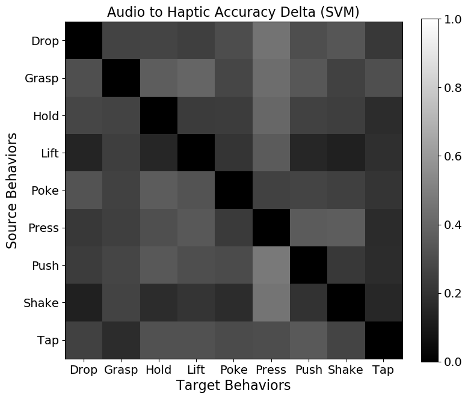
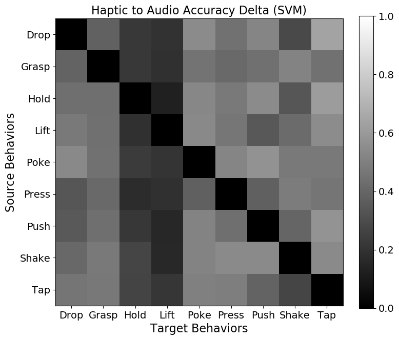
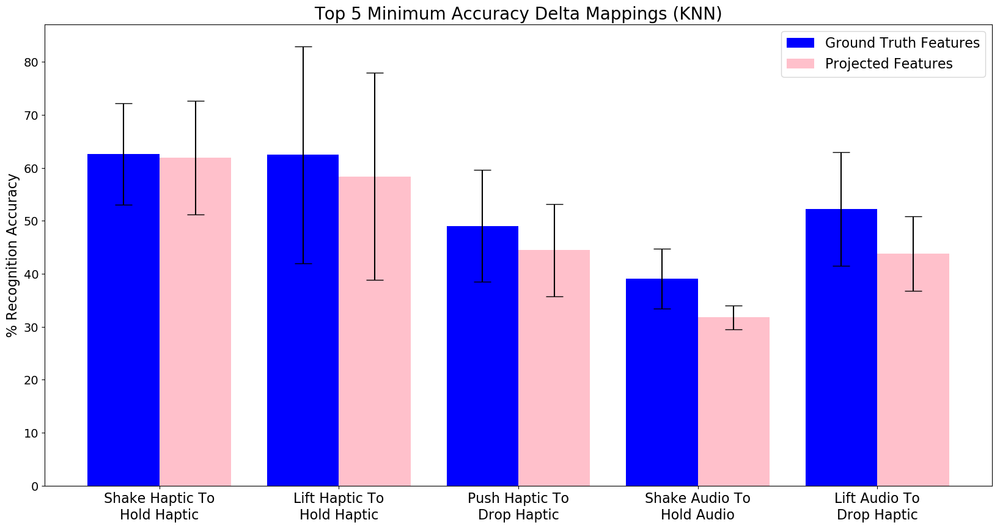
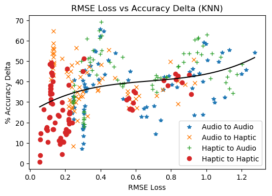

# Sensorimotor Cross-Behavior Knowledge Transfer for Grounded Category Recognition

**Abstract:**

> Humans use exploratory behaviors coupled with multi-modal perception to learn about the objects around them. Research in robotics has shown that robots too can use such behaviors (e.g., grasping, pushing, shaking) to infer object properties that cannot always be detected using visual input alone. However, such learned representations are specific to each individual robot and cannot be directly transferred to another robot with different actions, sensors, and morphology. To address this challenge, we propose a framework for knowledge transfer across different behaviors and modalities that enables a source robot to transfer knowledge about objects to a target robot that has never interacted with them. The intuition behind our approach is that if two robots interact with a shared set of objects, the produced sensory data can be used to learn a mapping between the two robots' feature spaces. We evaluate the framework on a category recognition task using a dataset containing 9 robot behaviors performed multiple times on a set of 100 objects. The results show that the proposed framework can enable a target robot to perform category recognition on a set of novel objects and categories without the need to physically interact with the objects to learn the categorization model.

## Development Environment
For our research, we used 64-bit Ubuntu 16.04 based computer with 16 GB RAM, Intel Core i7-7700 CPU (3.20 GHz x 8 cores) and NVIDIA GeForce GTX 1060 (3GB RAM, 1280 CUDA Cores).
The neural networks were implemented in widely used deep learning framework `TensorFlow 1.12` with GPU support (cuDNN 7, CUDA 9).

## Dependencies

`Python 3.5.6` is used for development and following packages are required to run the code:  
`pip install tensorflow-gpu==1.12.0` 
`pip install sklearn==0.20.0` 
`pip install matplotlib==3.0.0` 
`pip install numpy==1.15.3`

## [Dataset](Datasets)

- [Visualization of each modalities](DatasetVisualization.ipynb)

## How to run the code?

Run: `python main.py [mapping] [classifier]`

mapping: A2A, A2H, H2A, H2H  
classifier: KNN, SVM-RBF

Example: `python main.py H2H SVM-RBF`

## Experiment Pipeline 

- The source robot interacts with all the 20 categories (highlighted in solid red line), but the target robot interacts with only 15 categories (highlighted in solid blue line).

- The objects of 15 categories shared by both the robots are used to train the encoder-decoder network that learns to projects the sensory signal of the source robot to the target robot.

- Subsequently, the trained encoder-decoder network is used to generate “reconstructed” sensory signals for the other 5 object categories (highlighted in dashed blue line) that the target robot did not interact with by projecting the sensory signal of the source robot.

- Once the features are projected, an category recognition classifier is trained using the projected
data from the source context (i.e., how well it would do if it transfered knowledge from the source robot).

- Additional category recognition classifier is trained using the ground truth data produced by the target robot (i.e., the best the target robot could do if it had explored all the objects) for comparison.

## Results

## Support Vector Machine (SVM-RBF) 

### Accuracy

### RMSE loss vs Accuracy

### Accuracy Delta

### RMSE loss vs Accuracy Delta

## k-Nearest Neighbors (3-NN)

### Accuracy

### RMSE loss vs Accuracy

### Accuracy Delta

### RMSE loss vs Accuracy Delta

